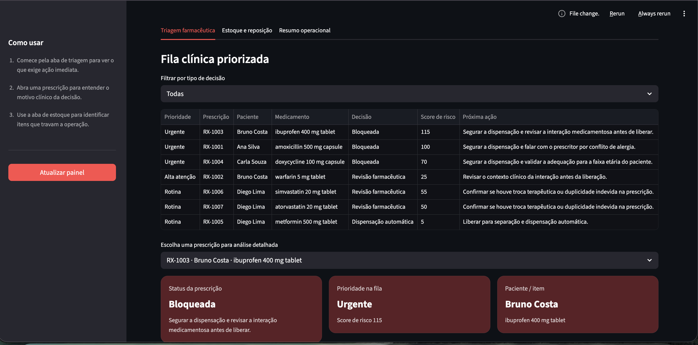
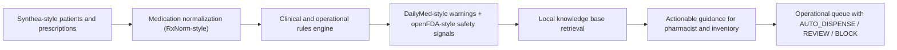

# ai-automatic-pharmacy-system

## Português

`ai-automatic-pharmacy-system` é um projeto de **IA aplicada a farmácia automática** com foco em duas dores reais:

- ajudar o farmacêutico a decidir o que precisa de intervenção humana;
- ajudar a operação a enxergar quais itens do estoque travam a dispensação.



Em vez de tratar a automação como simples separação de caixas, o projeto assume que uma farmácia inteligente precisa tomar uma decisão segura, explicável e operacionalmente útil antes de liberar um item.

## O que o sistema faz

O sistema lê uma base sintética inspirada em cenários reais de saúde e, para cada prescrição, responde:

- pode seguir para `AUTO_DISPENSE`?
- precisa de `PHARMACIST_REVIEW`?
- deve entrar em `BLOCK`?

Depois disso, ele devolve uma orientação pronta para ação para a equipe farmacêutica e para o estoque.

## Arquitetura funcional

O projeto foi desenhado em três camadas:

### 1. Rules engine

O núcleo decisório é determinístico e auditável. Ele avalia:

- conflito de alergia
- restrição etária
- interação medicamentosa detectada
- interação medicamentosa maior
- duplicidade terapêutica
- estoque insuficiente
- medicamento de alto risco

### 2. Retrieval documental (`RAG-style`)

Depois da decisão, o sistema consulta uma base documental local para recuperar referências úteis sobre:

- alergias
- interações
- pediatria
- duplicidade de classe
- ruptura de estoque
- medicamentos de alto risco
- critérios de dispensação automática segura

Essa camada é **RAG-style**, mas propositalmente leve e local:

- sem dependência de API externa
- sem embeddings obrigatórios
- baseada em retrieval lexical e priorização por tópico

### 3. Explanation layer

Por fim, o projeto monta uma orientação final legível para o time:

- o que aconteceu
- por que aconteceu
- o que o farmacêutico deve fazer
- o que o estoque deve fazer
- quais documentos sustentaram a orientação


## Bases públicas escolhidas

### Base principal

- [Synthea](https://synthetichealth.github.io/synthea/)

Papel no desenho:

- pacientes sintéticos realistas
- alergias
- backbone de prescrições
- contexto assistencial sem problema de privacidade

### Fontes de enriquecimento

- [RxNorm](https://www.nlm.nih.gov/research/umls/rxnorm/index.html)
- [DailyMed](https://dailymed.nlm.nih.gov/)
- [openFDA](https://open.fda.gov/apis/)

Papel no desenho:

- `RxNorm`: normalização farmacêutica e ingrediente ativo
- `DailyMed`: warning, contraindicação e guidance de uso
- `openFDA`: sinais públicos de risco e criticidade

### Evolução futura

- [MIMIC-IV](https://physionet.org/content/mimiciv/3.0/)

Uso futuro possível:

- validação hospitalar de maior realismo
- administração medicamentosa mais complexa
- benchmark em cenário clínico credenciado

## Dataset local do projeto

O repositório gera automaticamente:

- `patients.csv`
- `allergies.csv`
- `prescriptions.csv`
- `formulary.csv`
- `drug_interactions.csv`
- `inventory.csv`
- `knowledge_base.csv`
- `public_dataset_reference.json`

Essa decisão deixa o projeto:

- reproduzível
- seguro
- portátil
- fácil de publicar no GitHub

## Ferramentas e bibliotecas utilizadas

Ferramentas principais:

- `Python`
- `Streamlit`
- `unittest`

Bibliotecas da standard library usadas no núcleo:

- `csv`
- `json`
- `pathlib`
- `collections.Counter`
- `collections.defaultdict`
- `re`
- `typing`

Arquivos principais:

- [main.py](main.py)
- [streamlit_app.py](streamlit_app.py)
- [src/data_factory.py](src/data_factory.py)
- [src/pipeline.py](src/pipeline.py)
- [src/rag.py](src/rag.py)
- [src/operations.py](src/operations.py)
- [tests/test_pipeline.py](tests/test_pipeline.py)

## Técnicas utilizadas

### 1. Integração de dados tabulares

O pipeline cruza:

- pacientes
- alergias
- prescrições
- formulário farmacêutico
- interações medicamentosas
- inventário
- base documental local

### 2. Normalização semântica de medicamento

Cada item recebe atributos padronizados, como:

- `rxnorm_code`
- `active_ingredient`
- `therapeutic_class`
- `allergy_group`

### 3. Rule-based clinical decisioning

O motor de decisão é baseado em regras clínicas e operacionais, não em um classificador probabilístico.

Isso foi uma escolha intencional porque, nesse domínio, o núcleo decisório precisa ser:

- auditável
- previsível
- explicável
- fácil de justificar

### 4. Risk scoring heurístico

Cada prescrição recebe um `risk_score` usado para priorização da fila.

Esse score considera pesos para:

- alergia
- interação maior
- restrição etária
- duplicidade terapêutica
- ruptura de estoque
- medicamento de alto risco

### 5. Queue prioritization

As prescrições são convertidas em prioridade operacional:

- `P1`
- `P2`
- `P3`

Isso aproxima o sistema do dia a dia da farmácia, onde não basta classificar: é preciso ordenar trabalho.

### 6. Retrieval documental local

A camada `RAG-style` usa:

- tokenização lexical
- interseção de termos
- bônus por tópico preferencial
- ranking simples de documentos relevantes

Ela não substitui o rules engine. Ela entra **depois** da decisão para enriquecer a orientação.

### 7. Explainable AI

O sistema gera:

- `decision`
- `queue_priority`
- `risk_score`
- `explanation`
- `rag_guidance`
- `stock_guidance`
- `retrieved_titles`
- `retrieved_document_ids`

### 8. Simulação operacional reutilizando o motor real

O projeto também expõe uma simulação manual de nova prescrição usando a mesma lógica da fila produtiva.

Isso significa que a demo não usa uma lógica paralela simplificada: ela reaproveita o motor central para testar cenários como:

- alergia conhecida
- interação com medicação ativa
- duplicidade terapêutica
- refill
- estoque disponível no momento
- prioridade clínica

## Arquitetura



## Interface de teste

O projeto inclui uma interface local em `Streamlit` desenhada como uma **central operacional de farmácia**.

Ela está organizada em três abas:

- `Triagem farmacêutica`
- `Estoque e reposição`
- `Resumo operacional`
- `Simulação manual`

Na prática, a interface permite:

- ver a fila já priorizada
- filtrar por decisão
- abrir uma prescrição específica
- ler uma orientação pronta para ação
- entender o motivo clínico resumido
- ver warning farmacêutico
- acompanhar itens de estoque críticos
- identificar quantas prescrições estão travadas por item
- enxergar o **saldo após a demanda pendente**, e não só o estoque bruto
- simular uma nova prescrição manualmente e receber a mesma avaliação do motor real

Esse ponto é importante porque aproxima a interface de um fluxo real de balcão, revisão farmacêutica ou validação operacional antes da dispensação.

## Artefatos gerados

- [automatic_pharmacy_report.json](data/processed/automatic_pharmacy_report.json)
- [dispense_queue.csv](data/processed/dispense_queue.csv)

Colunas relevantes do `dispense_queue.csv`:

- `decision`
- `queue_priority`
- `risk_score`
- `interaction_detected`
- `explanation`
- `rag_guidance`
- `stock_guidance`
- `retrieved_titles`
- `retrieved_document_ids`
- `available_units`
- `requested_units`

## Resultados atuais

- `patient_count = 4`
- `prescription_count = 7`
- `blocked_count = 3`
- `pharmacist_review_count = 3`
- `auto_dispense_count = 1`
- `top_priority_decision = BLOCK`

## Como executar

```bash
python3 main.py
python3 -m unittest discover -s tests -v
python3 -m py_compile main.py streamlit_app.py src/data_factory.py src/pipeline.py src/rag.py src/operations.py tests/test_pipeline.py
streamlit run streamlit_app.py --server.port 8529
```


## Próximos passos possíveis

- trocar o retrieval lexical por embeddings farmacêuticos reais
- acoplar um LLM para reescrever a orientação em linguagem mais natural
- usar FHIR `MedicationRequest` / `MedicationDispense`
- expandir a base de interações
- incluir previsão de ruptura de estoque

## English

`ai-automatic-pharmacy-system` is an AI-driven automatic pharmacy project designed to support both pharmacist triage and inventory operations.

It combines:

- a `Synthea-style` synthetic patient and prescription backbone
- `RxNorm-style` medication normalization
- `DailyMed-style` warning enrichment
- `openFDA-style` safety signals
- a deterministic rules engine
- and a lightweight local `RAG-style` retrieval layer for actionable guidance

The system classifies each prescription into:

- `AUTO_DISPENSE`
- `PHARMACIST_REVIEW`
- `BLOCK`

and then generates an operational guidance layer for pharmacist and stock teams.
