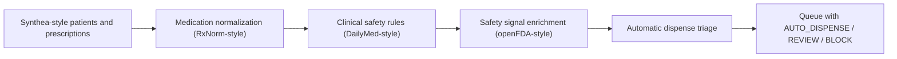

# ai-automatic-pharmacy-system

## Português

`ai-automatic-pharmacy-system` é um projeto de **IA aplicada a farmácia automática** com foco em triagem farmacêutica, segurança medicamentosa e decisão operacional antes da dispensação.

Ele foi desenhado para responder a uma pergunta prática: **o que um sistema de farmácia inteligente precisa validar antes de liberar automaticamente um medicamento?**

Neste projeto, a resposta passa por quatro blocos:

- dados clínicos e prescrições;
- normalização de medicamentos;
- conhecimento farmacêutico estruturado;
- e regras automáticas de segurança e operação.

## Storytelling do básico ao técnico

Uma farmácia automática não deve apenas “separar caixas”. Para ser clinicamente útil e operacionalmente segura, ela precisa checar se a prescrição pode ser dispensada sem risco óbvio e sem criar problema logístico.

Este MVP mostra exatamente esse fluxo:

- recebe prescrições sintéticas no estilo de um ambiente real;
- cruza paciente, alergia e medicamento;
- normaliza o medicamento em uma camada tipo `RxNorm`;
- aplica regras inspiradas em `DailyMed` e sinais de segurança tipo `openFDA`;
- verifica duplicidade terapêutica, interação medicamentosa, restrição etária e estoque;
- e devolve uma decisão final:
  - `AUTO_DISPENSE`
  - `PHARMACIST_REVIEW`
  - `BLOCK`

## Bases públicas escolhidas

### Base principal

- [Synthea](https://synthetichealth.github.io/synthea/)

Por que foi escolhida:

- gera pacientes sintéticos realistas;
- inclui histórico de medicamentos, alergias e encounters;
- é pública, gratuita e sem risco de privacidade;
- é excelente para prototipar sistemas clínicos no GitHub.

### Fontes de enriquecimento

- [RxNorm](https://www.nlm.nih.gov/research/umls/rxnorm/index.html)
- [DailyMed](https://dailymed.nlm.nih.gov/)
- [openFDA](https://open.fda.gov/apis/)

Papel de cada uma:

- `RxNorm`: padronização e normalização de nomes de medicamentos
- `DailyMed`: warnings, contraindicações e trechos de orientação farmacêutica
- `openFDA`: sinais públicos de segurança e farmacovigilância

### Base avançada para evolução futura

- [MIMIC-IV](https://physionet.org/content/mimiciv/3.0/)

Observação:

- `MIMIC-IV` é muito forte para evolução hospitalar real, mas exige credenciamento e treinamento, então não é a melhor escolha para começar rápido no GitHub.

## O que o projeto faz

O pipeline constrói uma fila de dispensação com decisão explicável para cada prescrição.

Regras implementadas:

- conflito de alergia
- restrição etária
- interação medicamentosa maior
- duplicidade terapêutica
- estoque insuficiente
- marcação de medicamento de alto risco

Saídas possíveis:

- `AUTO_DISPENSE`: pode seguir automaticamente
- `PHARMACIST_REVIEW`: precisa de revisão humana
- `BLOCK`: não pode ser liberado automaticamente

## Topologia do projeto

- [src/data_factory.py](/Users/flaviagaia/Documents/CV_FLAVIA_CODEX/ai-automatic-pharmacy-system/src/data_factory.py)
- [src/pipeline.py](/Users/flaviagaia/Documents/CV_FLAVIA_CODEX/ai-automatic-pharmacy-system/src/pipeline.py)
- [main.py](/Users/flaviagaia/Documents/CV_FLAVIA_CODEX/ai-automatic-pharmacy-system/main.py)
- [tests/test_pipeline.py](/Users/flaviagaia/Documents/CV_FLAVIA_CODEX/ai-automatic-pharmacy-system/tests/test_pipeline.py)

## Arquitetura



## Dataset local do projeto

O repositório gera automaticamente uma base sintética com:

- `patients.csv`
- `allergies.csv`
- `prescriptions.csv`
- `formulary.csv`
- `drug_interactions.csv`
- `inventory.csv`
- `public_dataset_reference.json`

Essa estratégia deixa o projeto:

- reproduzível;
- seguro do ponto de vista de privacidade;
- fácil de executar em qualquer máquina;
- e alinhado a um caso real de Health IT.

## Lógica técnica do pipeline

### 1. Backbone clínico

O projeto parte de pacientes e prescrições em um formato inspirado em `Synthea`.

Isso permite simular:

- idade
- setting assistencial
- alergias
- medicação ativa
- refill
- prioridade clínica

### 2. Normalização farmacêutica

Cada medicamento é enriquecido com uma camada `RxNorm-style`:

- `rxnorm_code`
- `active_ingredient`
- `therapeutic_class`
- `allergy_group`

Essa camada é importante porque uma farmácia automática não pode depender apenas do nome textual digitado na prescrição.

### 3. Conhecimento farmacêutico estruturado

O formulário local inclui trechos de warning e idade mínima no estilo de `DailyMed`, além de contagem de sinais públicos no estilo `openFDA`.

Isso permite acoplar:

- warning clínico
- classes terapêuticas
- risco de segurança
- explicabilidade da decisão

### 4. Motor de decisão

Cada prescrição recebe uma pontuação e uma decisão.

Exemplos:

- alergia ao grupo do medicamento → `BLOCK`
- interação maior entre `warfarin` e `ibuprofen` → `BLOCK`
- uso pediátrico abaixo da idade mínima → `BLOCK`
- duplicidade de estatinas → `PHARMACIST_REVIEW`
- estoque insuficiente → `PHARMACIST_REVIEW`
- prescrição estável e segura → `AUTO_DISPENSE`

## Resultados atuais

- `patient_count = 4`
- `prescription_count = 7`
- `blocked_count = 3`
- `pharmacist_review_count = 3`
- `auto_dispense_count = 1`
- `top_priority_decision = BLOCK`

## Artefatos gerados

- [automatic_pharmacy_report.json](/Users/flaviagaia/Documents/CV_FLAVIA_CODEX/ai-automatic-pharmacy-system/data/processed/automatic_pharmacy_report.json)
- [dispense_queue.csv](/Users/flaviagaia/Documents/CV_FLAVIA_CODEX/ai-automatic-pharmacy-system/data/processed/dispense_queue.csv)

## Como executar

```bash
python3 main.py
python3 -m unittest discover -s tests -v
python3 -m py_compile main.py src/data_factory.py src/pipeline.py
```

## Como defender o projeto em entrevista

Uma forma boa de explicar:

> Eu modelei um sistema de farmácia automática que usa uma base sintética inspirada em Synthea e a enriquece com conceitos de RxNorm, DailyMed e openFDA para decidir se uma prescrição pode ser dispensada automaticamente, precisa de revisão farmacêutica ou deve ser bloqueada.

## Próximos passos possíveis

- conectar uma interface `Streamlit`
- adicionar RAG farmacêutico para justificativas textuais
- usar FHIR MedicationRequest / MedicationDispense
- plugar uma base maior de interações
- evoluir para previsão de ruptura de estoque

## English

`ai-automatic-pharmacy-system` is an AI-driven automatic pharmacy triage project designed to simulate how a medication dispensing system can validate safety and operational constraints before releasing medication.

It combines:

- a `Synthea-style` synthetic patient and prescription backbone
- `RxNorm-style` medication normalization
- `DailyMed-style` warning and contraindication enrichment
- `openFDA-style` public safety signal enrichment

The pipeline classifies each prescription into:

- `AUTO_DISPENSE`
- `PHARMACIST_REVIEW`
- `BLOCK`

based on allergy conflicts, age restriction, drug-drug interaction, therapeutic duplication, stock shortage, and high-risk medication status.
